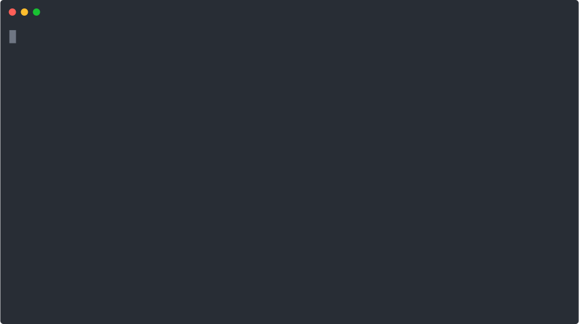

# Lore

A self-maintaining **lore** system for [Claude Code](https://claude.com/claude-code) and
[OpenAI Codex](https://developers.openai.com/codex): capture the non-obvious things you
learn while working, automatically surface the relevant ones back into context next time,
and keep them from going stale as the code changes. Each task makes the next one easier.

> Every unit of work should leave behind something that makes
> the next unit of work cheaper. This plugin is that flywheel for a codebase.

## See it in action

A hooks plugin is invisible by design — here's the part you'd otherwise never
see: **recall appears on its own** (you ran no command), and the **LORE CHECK**
nudge closes the turn so capture never silently gets skipped.



<sub>The terminal output is **real** — produced by the actual `recall.py` /
`capture_check.py` hooks against the shipped example learning; only the typing
pace is scripted.</sub>

## The loop

```
        you prompt
            │
            ▼
   ┌─────────────────────┐   UserPromptSubmit hook
   │  recall              │── surfaces relevant past learnings into context
   └─────────────────────┘
            │
            ▼
     the agent works, using them
            │
            ▼
   ┌─────────────────────┐   Stop hook
   │  capture nudge       │── "did this turn produce a durable learning?"
   └─────────────────────┘
            │ yes
            ▼
   ┌─────────────────────┐   lore skill
   │  write one entry     │── a single markdown file under learnings/
   └─────────────────────┘
            │
            ▼
   ┌─────────────────────┐   linter + pre-push hook
   │  keep it fresh       │── flag deleted refs · drift-triage · regenerate index
   │  + guard the push    │── secret scan blocks a leak before it's published
   └─────────────────────┘
```

The store is plain markdown in **your** repo (committed, so your team benefits). The
behavior lives in the plugin. Nothing is sent anywhere — recall is a local text match.
Because the store is pushed by default, treat it as **published**: see [Security](#security).

## Requirements

- **[Claude Code](https://claude.com/claude-code)** or **[OpenAI Codex](https://developers.openai.com/codex)** (CLI or IDE extension).
- **Python 3** on `PATH` as `python3`, `python`, or `py` (stdlib only — no `pip install`).
- On **Windows** with Claude Code, the bundled **Git Bash** runs the hook wrappers
  (already required by Claude Code). The Codex installer bakes the interpreter path, so
  it needs no wrapper.

## Install

### Claude Code

```text
/plugin marketplace add aoc81/lore
/plugin install lore@lore
```

Then, once per project: `/lore:init` — creates the `learnings/` store (seeded with a
template + example) and optionally installs the non-blocking pre-push freshness hook.

### OpenAI Codex

From a clone of this repo — install once per machine, then trust the hooks in Codex:

```text
python3 codex/install.py        # registers recall + capture hooks under ~/.codex
# open Codex → /hooks → trust the two hooks
python3 codex/install.py --store   # per project: scaffold ./learnings (optional)
```

Codex uses the same `UserPromptSubmit` / `Stop` + `additionalContext` contract, so recall
and capture work natively and the core scripts + store are reused unchanged. Details and
caveats: **[codex/README.md](codex/README.md)**.

## How it works

**Recall (read).** On every prompt, a `UserPromptSubmit` hook tokenizes what you typed,
matches it against each learning's `title` + `tags` (never the body), and injects the
top few matches as paths + titles. The agent reads a file only if it's actually relevant.
Superseded entries are down-ranked and tagged so they're never mistaken for live guidance,
and each match carries cheap freshness flags (a deleted-file ref, or "verified N months
ago") so a possibly-stale learning is never trusted blindly. A `PreToolUse` hook adds
**edit-time recall**: when the agent is about to edit a file, any learning whose `files:`
names that path surfaces right then — the gotcha shows up exactly when you touch the code.

**Capture (write).** A `Stop` hook reminds the agent, at the end of a turn, to record a
learning *only* if it's both non-obvious and reusable. The `lore` skill defines the gate,
the routing, and the file format. Before writing, it runs a deterministic overlap check
(`recall.py --query`) so a new learning **updates** a related entry instead of duplicating
it. You can also trigger capture with `/lore:capture`.

**Freshness.** Code changes; learnings shouldn't silently rot. `/lore:lint` checks
that each entry's `files:` still exist; `--report` ranks entries whose referenced code
changed since they were last `verified:` (your re-verify worklist); `--index` regenerates
the store's README. `/lore:stats` prints a store-health snapshot (counts by status/category,
the drift backlog, long-unverified entries, dangling links). The optional pre-push hook runs
the existence check before every push.

## Commands

| Command | What it does |
|---|---|
| `/lore:init` | Scaffold the store in this project; optionally install the pre-push hook. |
| `/lore:capture [note]` | Capture a learning from the current work (via the skill). |
| `/lore:lint [--report\|--index\|--strict]` | Freshness linter: ref-check, drift triage, index regen. |
| `/lore:stats` | Store-health snapshot: counts, drift backlog, stale-age, dangling links. |
| `/lore:sweep [scope]` | Semantically re-verify drifted entries against the code and update them. |
| `/lore:scan [path]` | Scan the store for committed secrets (the pre-push guard, run on demand). |

These are **Claude Code** slash commands. On Codex there are no `/lore:*` commands —
`init` is `python3 codex/install.py`, `capture` is the `lore` skill + the `Stop` hook,
and `lint` is `python3 ~/.codex/lore/verify_refs.py` (see [codex/README.md](codex/README.md)).

## The learnings format

One fact per file, `learnings/<category>/<slug>.md`, with frontmatter:

```markdown
---
title: "Short, specific — this is what recall matches on"
date: 2026-01-01
track: knowledge        # or: bug
category: ci
tags: [ci, cache, lockfile]
files: [.github/workflows/ci.yml]   # the linter checks these still exist
status: current         # or: superseded / obsolete
verified: 2026-01-01     # optional; bump after a re-verify to clear it from drift triage
---
```

Body — **bug**: Problem · Root Cause · What Didn't Work · Solution · Prevention.
Body — **knowledge**: Context · Guidance · Why This Matters · When To Apply.

**Authoring for low drift:** reference code by stable symbol (function/class), not line
numbers; keep `files:` complete (it's the linter's surface); make tags the words a
future prompt would use.

## Configuration

Optional `.lore.json` in your project root:

```json
{
  "storeDir": "learnings",
  "maxRecall": 5,
  "staleStatuses": ["superseded", "obsolete", "deprecated"],
  "secretAllow": ["\\bAKIAEXAMPLE\\b"]
}
```

`secretAllow` is a list of regexes; a match on a line suppresses secret-scan
findings there (for genuine false positives or illustrative examples).

## Committed vs. private

Learnings are **committed and pushed by default** so a whole team shares them. To keep
them local/personal instead, add your store directory (e.g. `learnings/`) to `.gitignore`.

## Security

The store is committed and pushed by default and capture is autonomous — so a learning
is effectively **published the moment it's written**. The plugin is built around that:

- **Don't write secrets.** The capture skill is instructed to *reference* secrets, never
  quote them (no keys, tokens, credentials, connection strings, or PII in an entry).
- **Blocking secret scan at the push boundary.** The pre-push hook runs `scan_secrets.py`
  over the store and **aborts the push** if it finds a likely key/token/credential.
  Run it any time with `/lore:scan`. Bypass a false positive with `lore:allow-secret` on
  the line, a `secretAllow` regex, `LORE_SCAN_BLOCK=0`, or `git push --no-verify`.
- **Recall never echoes bodies.** The recall hook matches only `title` + `tags` and emits
  only paths + titles — store content is never auto-injected verbatim, which limits the
  prompt-injection surface of a shared/poisoned store.
- **Hooks run code on every turn.** Recall and capture execute local Python on each prompt
  and turn-end. Review the scripts before trusting them; on Codex, approve them via `/hooks`.
- **Pin the plugin.** Install a reviewed tag/commit rather than floating on `main`, so you
  control when new hook code starts running.

Everything runs locally with no network calls; the only thing that ever leaves your
machine is what *you* push — which is exactly what the secret scan guards.

## Customizing

- **Quieter capture:** the end-of-turn nudge is the `Stop` hook in `plugin/hooks/hooks.json`.
  Remove that block to make capture purely manual (`/lore:capture`).
- **Different store location/size:** use `.lore.json` (above).
- **Recall tuning:** the stop-word list and scoring live in `plugin/scripts/recall.py`.

## How it's built

Everything is stdlib Python, so one setup works on macOS, Linux, and Windows. Hooks use
the stdin-JSON / `additionalContext` contract that **Claude Code and Codex share** — the
Claude target resolves `python3`/`python`/`py` via a tiny `sh` wrapper; the Codex
installer bakes the interpreter path. No runtime dependencies, no network calls.

## License

MIT — see [LICENSE](LICENSE).
